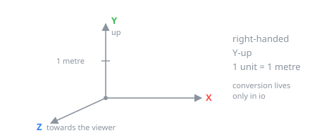
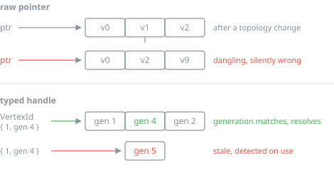
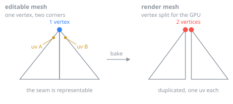
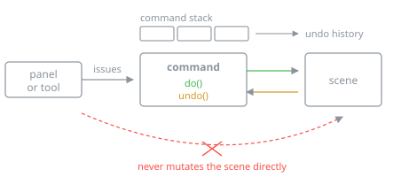

# Invariants

These are not preferences. Each one constrains how the engine is built, and each
is far more expensive to introduce later than to respect now. Breaking one does
not produce ugly code, it produces an editor that does not work.

- **Coordinates.** glTF's: right-handed, Y-up, metres. Conversion belongs in
  `io`, so that there is exactly one place where it can be wrong.

  

- **Handles, not pointers.** Mesh elements live in contiguous arenas and are
  referenced by typed handles carrying a generation counter. Pointers into a
  mesh are invalidated by every topology change, do not serialise, and make undo
  unworkable. Handle types are distinct, so passing a `FaceId` where a
  `VertexId` belongs will not compile.

  

- **Attributes on corners.** UVs, normals and vertex colours are per face-corner,
  not per vertex, which is what makes UV seams and hard edges representable. The
  render mesh splits vertices to satisfy the GPU; the editable mesh must not.

  

- **Mutations go through commands.** Every change to the scene is a command
  object with do and undo. The editor owns the scene, the command stack and the
  selection; panels and tools receive references and issue commands, never
  mutating the scene directly. This is what keeps undo reliable as the UI grows,
  and it cannot be retrofitted later.

  

- **`io` quarantines format concerns.** Coordinate conversion, unit handling and
  the bake that flattens editable data for export all live there. Nothing in
  `geom`, `scene` or `anim` knows that glTF exists, which is what makes adding
  another format a matter of adding files rather than threading changes through
  the core.

See [PROJECT_LAYOUT.md](PROJECT_LAYOUT.md) for the modules these refer to.
